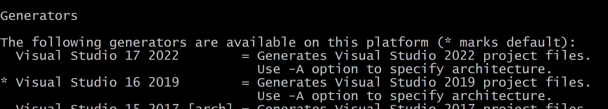
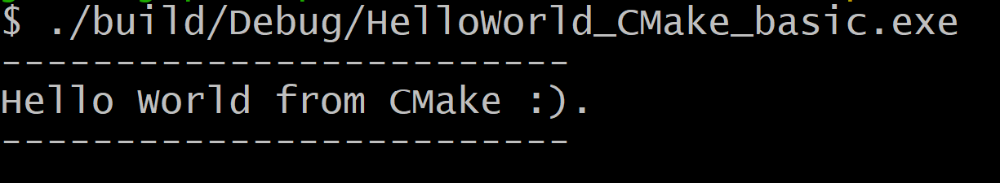

Below it the available **build system (aka generator)**.



Steps:
1. Generate Build Files
    ```bash
    cmake -S . -B build -G "Visual Studio 16 2019"
    ```

2. Build the Executable
    ```bash
    cmake --build build
    ```

3. Run the App  
    ```bash
    .build/Debug/HelloWorld_CMake_basic.exe
    ```

Result:


