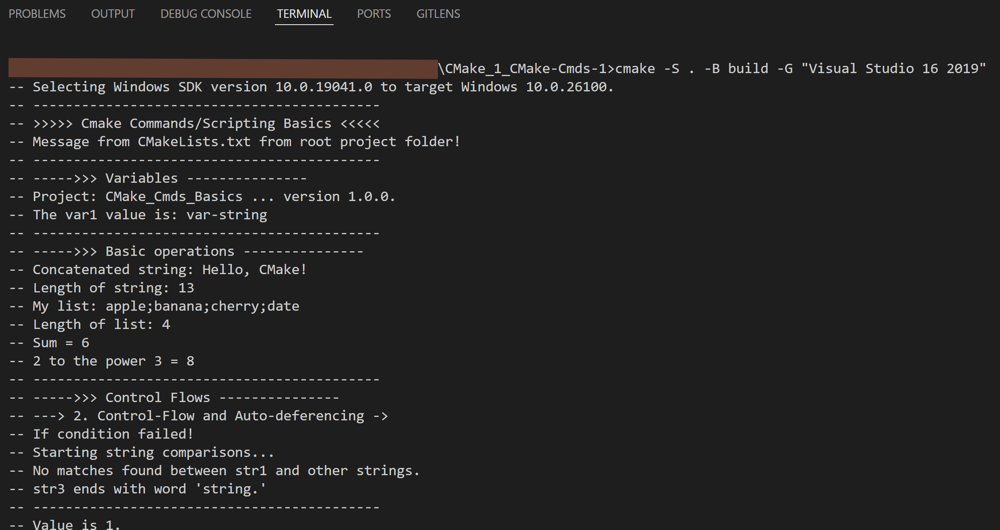
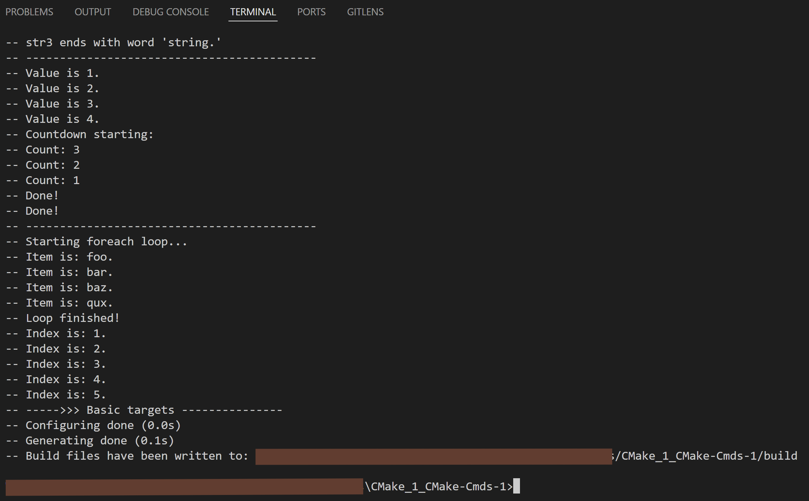
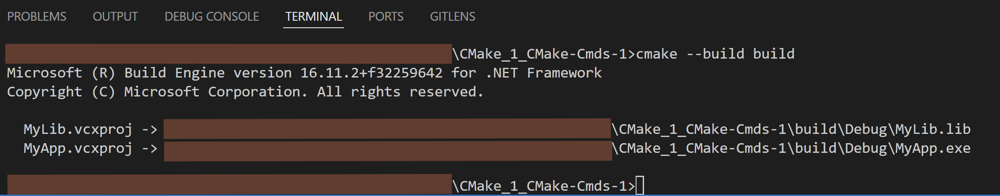

**GMake Commands Basics**

Commands/Scripting basic (Work can be seen in file '<project-root-folder>/CMakeLists.txt')  

## Contents  
- Project setup
- Messaging
- Variables
- Basic Operations
- Control Flows
- Basic targets

**Steps:**
1. Generate Build Files
    ```bash
    cmake -S . -B build -G "Visual Studio 16 2019"
    ```

2. Build the Executable
    ```bash
    cmake --build build
    ```

3. Run the App  
    ```bash
    .build/Debug/HelloWorld_CMake_basic.exe
    ```

**Result:**  
On *generating build files*:  


On *building executables*:  


On *running executable*:  

