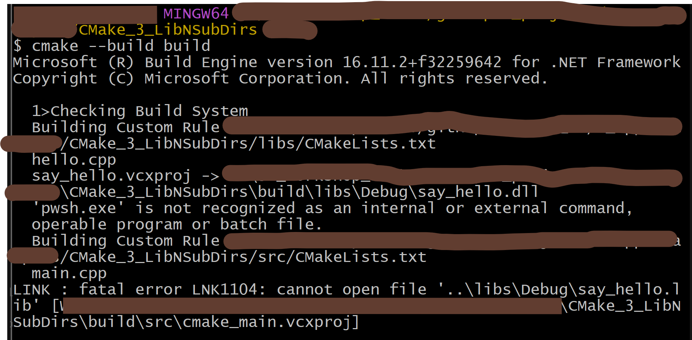

## Contents  
>> CMake Hello-World  
>> Adding a Library  
>> Subdirectories  

## Steps:
1. Generate Build Files
    ```bash
    cmake -S . -B build -G "Visual Studio 16 2019"
    ```

2. Build the Executable
    ```bash
    cmake --build build
    ```

3. Run the App  
    ```bash
    ./build/src/Debug/cmake_main.exe
    ```

## Problems:
```bash
# Define the 'hello' library
add_library(
    #say_hello SHARED
    say_hello STATIC
    src/hello/hello.cpp
    src/hello/hello.hpp
)

target_include_directories(say_hello PUBLIC
    ${CMAKE_CURRENT_SOURCE_DIR}/src
)
```
The above code snippet is of `/libs/CMakeLists.txt`. Using `say_hello SHARED` is giving problem:


However, using `say_hello STATIC` gives no problem. <span style="color:orange">Reason/Solution using `say_hello SHARED` To-Be-Found.</span>
