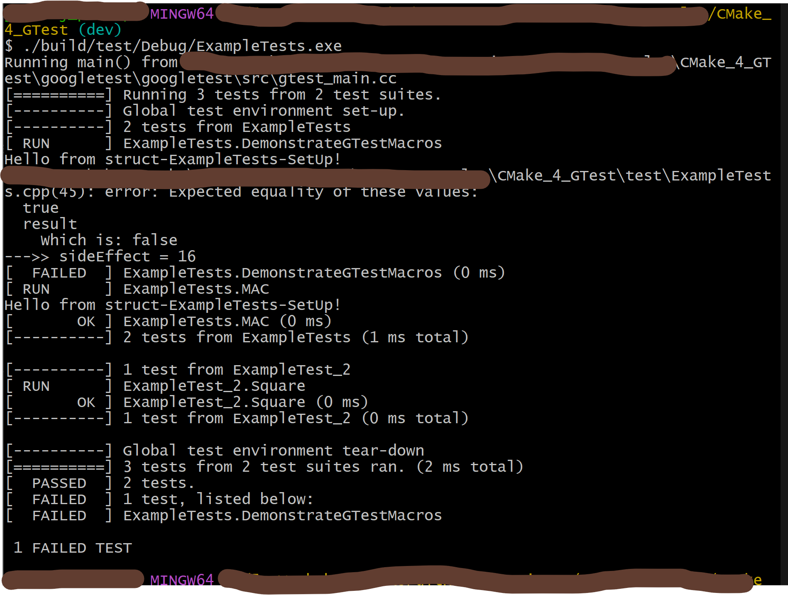

## Useful points:
>> For running .exe files of test results > run '\test\Debug>ExampleTests.exe' from terminal

## Steps:
1. Generate Build Files
    ```bash
    cmake -S . -B build -G "Visual Studio 16 2019"
    ```

2. Build the Executable
    ```bash
    cmake --build build
    ```

3. Run Test  
    ```bash
    ./build/test/Debug/ExampleTests.exe
    ```

Result:


