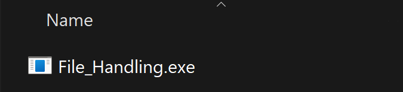
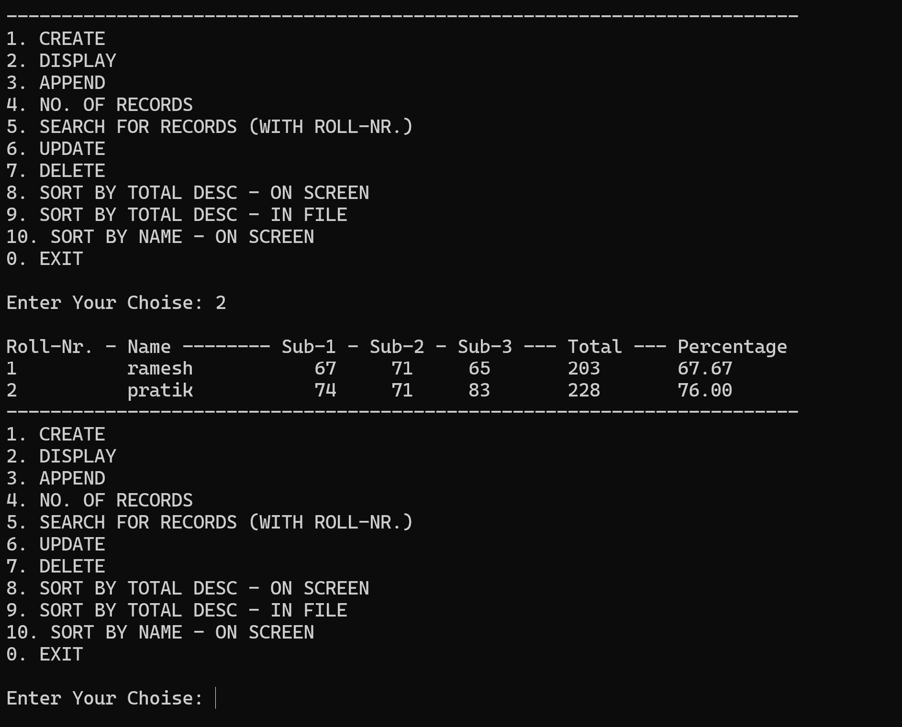

> Source file: '/File_Handling/File_Handling.cpp'  
> Test text file: '/File_Handling/studentsRec.txt' or at '/Debug/studentsRec.txt'  

1. Open the File_Handling.sln (double click it!)

2. Build the Project.

3. Run the App  
The App can be run using the run button in VS:

    ... or run the executable:  
    

4. Result:  

