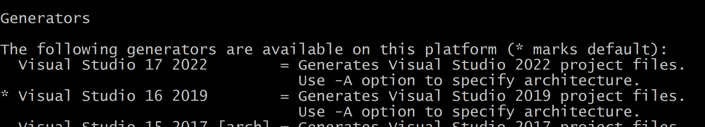
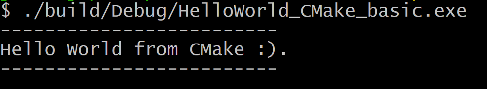

Below it the available **build system (aka generator)**.



1. Generate Build Files
```bash
cmake -S . -B build -G "Visual Studio 16 2019"
```

1. Build the Executable
```bash
cmake --build build
```

1. Run the App  
```bash
.build/Debug/HelloWorld_CMake_basic.exe
```

Result:


